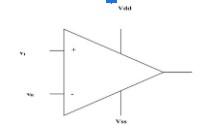
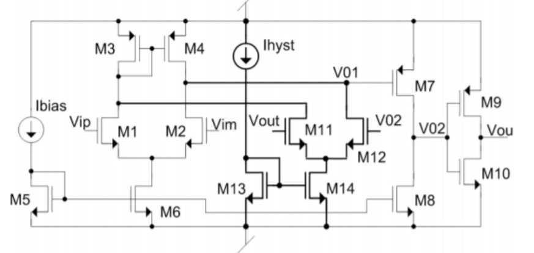
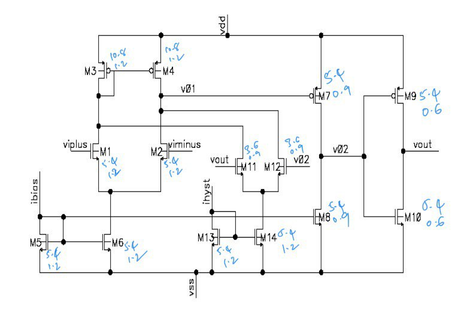

# Vsd_internship
Design Comparator IP for [Google Skywater 130nm](https://github.com/google/skywater-pdk) process

## Introduction
Comparator is a device which compares two input voltages or
current and outputs a digital signal based on the inputs. In this
internship we will look at voltage comparators. Input signal is
compared with a reference signal and a binary output is estimated.

An ideal simple comparator is an open loop differential amplifier
with one input as reference voltage and other input to the comparator
is the input voltage. The problem with such an amplifier is that with
small change in the inputs due to noise, output is triggered to change
which is not desired.

Therefore a threshold is set that makes the output switch only if
the input changes more than that threshold value for rise transition or
below the threshold for fall transition.. Hysteresis is defined as the
difference between the input signal level for which the output
switches high and the input signal level for which the output switches
low . The upper threshold is called VHL which is the threshold
when input goes from high to low and VLH is the threshold when
input goes from low to high.
For different applications these thresholds might need to be
different, therefore a comparator whoes hysteresis is programmable is
in need.

[//]: # "Comparator Building Blocks"
[//]: # "A comparator can be divided into three distinctive pieces – a frontend differential amplifier, amplifier stage and output stage."

## Comparator Circuit
Below is comparator circuit used for this IP take from [[1]](#1)

In the circuit above **Vip** and **Vim** are differential inputs. **Ihyst** is the current used to control the hysteresis. **Vout** is the output

[//]: # "The xschem project is in Prelayout folder."
[//]: # "Xschem can be set-up using [this link](https://www.youtube.com/watch?v=jXmmxO8WG8s)"

## Simulation
Weights for the circuit at 0.5um process from the paper

Sky130 doesn't have proportionate widths and lengths. Therefore the closest W/L ratios were chosen. Circuit was built and generated netlist was run through ngspice after including the required libraries. This was taken from [sky130_fd_pr](https://github.com/kunalg123/sky130CircuitDesignWorkshop/tree/main/design/sky130_fd_pr)

### Areas of improvement
<!--- The hysteresis at lower differential voltage is higher than the hysteresis at higher differential voltage. To get the circuit to work at wider range of voltages is difficult. A few variations of the circuit were tried as present in the PreLayout/archive folder. >
-->
## References
<a id="1">[1]</a> P. M. Furth, Y. Tsen, V. B. Kulkarni and T. K. Poriyani House Raju, "On the design of
low-power CMOS comparators with programmable hysteresis," 2010 53rd IEEE
International Midwest Symposium on Circuits and Systems, Seattle, WA, 2010, pp.
1077-1080, doi: 10.1109/MWSCAS.2010.5548836.
